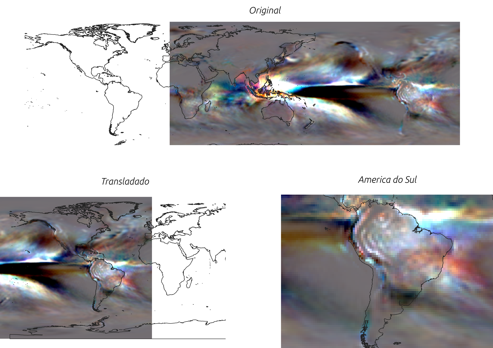

# Teste-Fractal
Conjunto de códigos desenvolvidos para o processo seletivo na Fractal

O objetivo do teste era automatizar o download de dados de precipitação da NOAA(NOMADS) usando a ferramenta grib filters, analisando os resultados do modelo em algumas bacias hidrográficas brasileiras e comparando-os com alguns resultados fornecidos.

# Considerações
Não foi feita a análise usando dados baixados em formato GRIB2 por duas razões:
1. Não foi encontrado na base de dados da NOAA informações metereológicas que abrangessem dados de precipitação, tendo como base o modelo CFSV2, se limitando a outras variáveis (ver referência 1). Por essa razão, optou-se por usar os dados de precipitação disponibilizados em formato NETCDF4;
2. Por questões técnicas que ainda estou avaliando, não foi possível instalar algumas dependências importantes para análise dos dados em formato GRIB2, em especial as ferramentas wgrib (da NOAA/NOMADS), pynio e GDAL. Embora o GDAL tenha sudo utilizado, sua execução foi conduziza no ambiente Python do QGIS, onde a biblioteca já estava instalada.
Apesar disso, apresenta-se o script para download automatizado dos dados GRIB2 usando o Grib Filters da NOAA

# Algoritmos (scripts)
## 01 - Download automatizado de dados GRIB2 da NOAA/NOMADS
Tem-se como entrada a data, no formado de string e AAAAMMDD. Realiza-se a tentativa de download para a resolução temoporal de 6 horas do modelo (00, 06, 12 e 18 horas). Salva-se os arquivo os arquivos e imprime mensagens de erro, caso o download não seja bem sucedido, o que usualmente acontece quando o dado não está disponível.

## 02 - Preparação dos arquivos NETCDF
Os arquivos NETCDF, gerados pelo modelo CFSV2 e disponíveis para download na referência 3, incluem os dados de precipitação. Baixados manualmente, precisam ser processado antes de ser usados. Nota-se que os arquivos estão na projeção WGS84, em escala global, mas com longitudes na faixa de (0 - 360), e que tem como ponto de longitude zero aquele que deveria ser o -180 na projeção WGS correta. Portanto, transladou-se essas informações em 360 graus para esquerda, usando a biblioteca GDAL.

Referências:
1. https://nomads.ncep.noaa.gov/ - acesso ao dados NOAA/NOMADS.
2. https://nomads.ncep.noaa.gov/cgi-bin/filter_cfs_flx.pl?dir=%2Fcfs.20211031%2F12%2F6hrly_grib_01 - Dados gerados pelo modelo CFSV2 disponíveis para download
3. https://www.cpc.ncep.noaa.gov/products/CFSv2/CFSv2_body.html - Acesso aos dados de precipitação do modelo CFSV2
